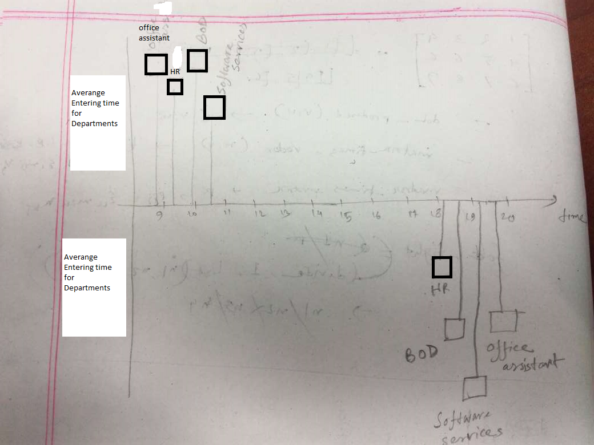

# Questions and answers from the dataset for data visualization for assignment 2

## Introduction

* Our purpose is to find out possible questions and answers for data visualization from the given data set HR&Admin__2020-01__attendance-log.xlsx

## Questions

1. Which department's employees come faster than others on an average?
2. Which department's employees come later than others on an average?
3. Which department's employees leave office faster on an average?
4. Which department's employees leave office later on an average?
5. In which weekday do the employees come office faster on an average?
6. In which weekday do the employees come office later on an average?
7. In which weekday do the employees leave office faster on an average?
8. In which weekday do the employees leave office later on an average?
9. Which is the most used way for Identification?
10. What percentage of employees come to the office before 10 am on each day?
11. What is the most frequent exception detection?
12. In which weekday is the attendance rate higher on an average?
13. Which employee comes faster on an average?
14. Which employee comes later on an average?
15. Which employee leaves faster on an average?
16. Which employee leaves later on an average?
17. How many employees from every department were present on a particular day?
18. Who is present at a particular time?
19. Who stays longer at the office on an average?

## Answers

* For Questions no. 1, 2, 3 & 4, the graph to visualize data would look like this- 

* For Questions no. 5, 6, 7 & 8, the graph to visualize data would look like this- 

* For Question no. 9, the graph to visualize data would look like this- 

* For Question no. 11, the graph to visualize data would look like this- 
